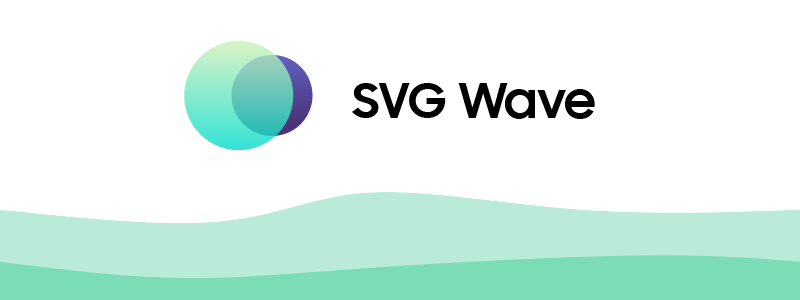
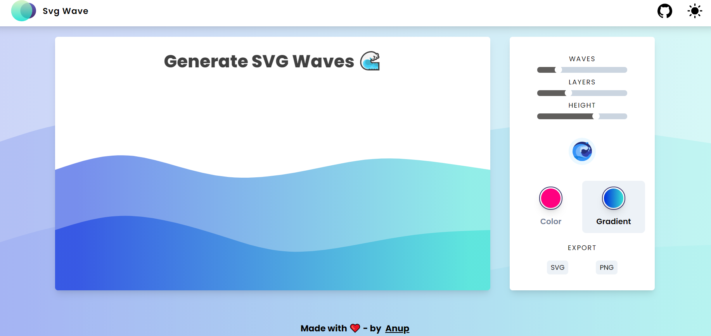
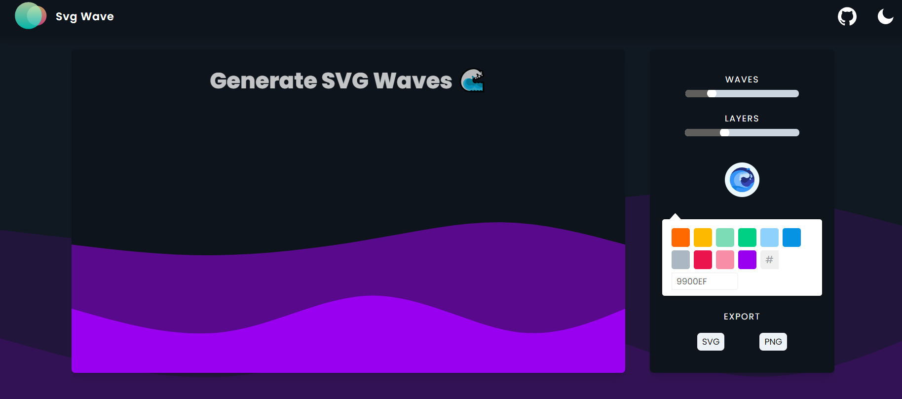

# 🌊 [SVG Wave](https://www.svgwave.in) - A tiny, customizable gradient SVG wave generator

SVG Wave is a **tiny, free and beautiful gradient SVG waves generator** for your UI or website desgin. It offers dead simple UI to customize, and style your waves based on your theme specifications.

SVG Wave is a tiny UI tool built with **Preact, tailwind and bundled with Webpack**. ⚛

---

### 💡 Update 1 - Added animation support, enable animation by simple click and export as SVG.
### 💡 Update 2 ! - New Gradient Wave Support 🌈

### Features

 - Adjust number of layers of waves 🏢
 - Modify the number of crest and trough ➰
 - Change Colors of waves 🎨
 - Export as SVG or PNG ⬇
 - Randomize 🔁
 - New cool Dark mode 🖤
 - Gradient fill to waves 🌈
 - Added Animations
 - Coming soon...
  

---

### App ⭐

---

### Contributions & Hacktoberfest ❤

We whole heartedly welcome new contributions either fixing a issue, adding a new customization or simply improving the stylings.

We truly ❤️ pull requests! If you wish to help, you can learn more about how you can contribute to this project in the contribution guide.

Give a star if you like It.👍

---

### Contributors

- [anup-a](https://github.com/anup-a)
- [kychok98](https://github.com/kychok98)
- [yencolon](https://github.com/yencolon)
- [Remakh](https://github.com/Remakh)
- [ansh-les](https://github.com/ansh-les)
- [ansh-saini](https://github.com/ansh-saini)
